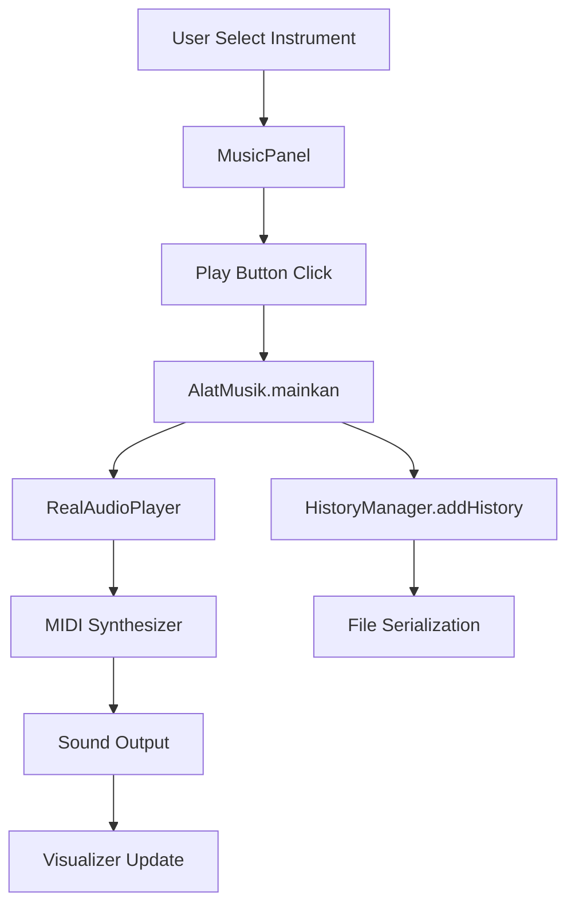

# 🎵 Sistem Simulator Alat Musik

<div align="center">


**Simulator alat musik canggih dengan GUI modern, audio real, dan visualizer dinamis**

[Fitur](#-fitur) • [Instalasi](#-instalasi) • [Penggunaan](#-penggunaan) • [Dokumentasi](#-dokumentasi) • [Struktur Project](#-struktur-project)

</div>

## 📋 Daftar Isi

- [Gambaran Umum](#-gambaran-umum)
- [Fitur](#-fitur)
- [Instalasi](#-instalasi)
- [Penggunaan](#-penggunaan)
- [Dokumentasi](#-dokumentasi)
- [Struktur Project](#-struktur-project)
- [Contoh Penggunaan](#-contoh-penggunaan)
- [FAQ](#-faq)

## 🚀 Gambaran Umum

**Sistem Simulator Alat Musik** adalah aplikasi simulator alat musik yang komprehensif dengan antarmuka grafis modern yang dibangun menggunakan Java Swing. Aplikasi ini tidak hanya mensimulasikan 6 alat musik berbeda, tetapi juga dilengkapi dengan audio real menggunakan MIDI, visualizer dinamis, sistem riwayat, dan fitur-fitur profesional lainnya.

### ✨ Highlights

- 🎵 **6 Alat Musik Real** dengan karakteristik autentik
- 🔊 **Audio MIDI Real** untuk pengalaman mendengar yang nyata
- 📊 **Visualizer Dinamis** dengan animasi waveform
- 💾 **Sistem Riwayat** dengan penyimpanan otomatis
- 🎨 **GUI Modern** dengan tabbed interface
- 📁 **Export Data** ke format teks
- ⭐ **Aksi Spesial** untuk setiap alat musik

## 🌟 Fitur

### 🎵 Simulasi Alat Musik
- **🎹 Piano** - Chord dan melodi harmonik
- **🎻 Biola** - Nada emosional dengan vibrato
- **🎸 Gitar** - Riff rock dan chord akustik
- **🥁 Drum Set** - Beat energik dan fill
- **🎷 Saxophone** - Improvisasi jazz yang smooth
- **🎺 Trumpet** - Fanfare heroik dan terang

### 🔊 Sistem Audio
- **MIDI Real-time** menggunakan Java Sound API
- **Polyphonic Support** bisa mainkan chord dan multiple notes
- **Volume Control** dengan slider interaktif
- **Fallback System** jika MIDI tidak tersedia
- **Generated Tones** menggunakan gelombang sinus
- **Audio Visualization** waveform real-time

### 💾 Manajemen Data
- **Auto-save History** semua simulasi tersimpan otomatis
- **Serialization** format biner untuk performa optimal
- **Export to Text** ekspor riwayat ke format readable
- **Session Management** kelola multiple sessions
- **Backup System** fitur backup data

### 🎨 Antarmuka Pengguna
- **Tabbed Interface** navigasi yang terorganisir
- **Dark Theme** tema modern yang eye-friendly
- **Responsive Design** adaptif berbagai resolusi
- **Real-time Updates** statistik dan info real-time
- **Tooltips** panduan kontekstual
- **Icons & Emojis** visual yang menarik

### 📊 Fitur Tambahan
- **Visualizer Audio** animasi waveform dinamis
- **Riwayat Detil** timestamp dan aksi spesifik
- **Info Edukasi** sejarah dan cara main alat musik
- **Aksi Spesial** fitur unik setiap alat musik
- **Keyboard Shortcuts** navigasi cepat

## 📥 Instalasi

### Prerequisites

- Java 8 atau lebih tinggi
- Sound card dengan MIDI support
- Speaker/headphone

### Step-by-Step Installation

1. **Download Project**
   ```bash
   git clone https://github.com/username/music-instrument-simulator.git
   cd music-instrument-simulator
   ```

2. **Struktur Project**
   ```
   src/
   ├── model/         # Model alat musik
   ├── gui/           # Antarmuka pengguna
   ├── utils/         # Utilities dan managers
   ├── enums/         # Enumerations
   └── Main.java      # Entry point
   ```

3. **Compile Project**
   ```bash
   # Menggunakan batch file (Windows)
   ./run.bat
   
   # Menggunakan shell script (Linux/Mac)
   chmod +x run.sh
   ./run.sh
   
   # Manual compilation
   javac -d . src/enums/*.java src/model/*.java src/utils/*.java src/gui/*.java src/Main.java
   ```

4. **Jalankan Aplikasi**
   ```bash
   java Main
   ```

### Quick Start (Windows)
```bash
# Download project, ekstrak, dan double-click run.bat
./run.bat
```

## 🎮 Penggunaan

### Menjalankan Aplikasi

```bash
java Main
```

Aplikasi akan menampilkan welcome message dan membuka GUI utama.

### Basic Usage

1. **Tab Simulator** - Mainkan alat musik
   - Pilih alat musik dari dropdown
   - Klik "🎵 Mainkan" untuk memainkan suara dasar
   - Klik "⭐ Aksi Spesial" untuk fitur unik
   - Klik "ℹ️ Info Detail" untuk informasi lengkap

2. **Tab Riwayat** - Lihat history simulasi
   - Tabel riwayat semua simulasi
   - Tombol refresh untuk update data
   - Export ke file teks
   - Clear history

3. **Tab Visualizer** - Visualisasi audio
   - Animasi waveform real-time
   - Gradient color effects
   - Informasi visualizer

### Kontrol Audio

- **Volume Slider**: Atur volume MIDI
- **Checkbox Real Sound**: Aktif/nonaktif suara MIDI
- **Tombol Stop**: Hentikan semua suara
- **Volume +/-**: Kontrol volume cepat

### Keyboard Shortcuts

| Shortcut | Action |
|----------|--------|
| `Ctrl + 1` | Buka tab Simulator |
| `Ctrl + 2` | Buka tab Riwayat |
| `Ctrl + 3` | Buka tab Visualizer |
| `Ctrl + Q` | Keluar aplikasi |

## 📚 Dokumentasi

### Architecture Overview

```
Sistem Simulator Alat Musik
├── Presentation Layer (GUI)
│   ├── MainFrame - Window utama
│   ├── MusicPanel - Simulator alat musik
│   ├── HistoryPanel - Manajemen riwayat
│   └── VisualizerPanel - Visualisasi audio
├── Business Logic Layer
│   ├── AlatMusik (Abstract) - Base class
│   ├── Concrete Instruments - Implementasi spesifik
│   └── Feature Managers - Manajer fitur
├── Data Access Layer
│   ├── HistoryManager - Kelola riwayat
│   ├── FileHandler - Operasi file
│   └── AudioPlayer - Sistem audio
└── Utilities Layer
    ├── KategoriAlat (Enum) - Kategorisasi
    └── Configurations - Pengaturan
```

### Workflow Simulasi



## 🗂️ Struktur Project

```
src/
├── 📁 model/
│   ├──  AlatMusik.java           # Abstract base class
│   ├──  Piano.java               # Implementasi piano
│   ├──  Biola.java               # Implementasi biola
│   ├──  Gitar.java               # Implementasi gitar
│   ├──  Drum.java                # Implementasi drum
│   ├──  Saxophone.java           # Implementasi saxophone
│   └──  Trumpet.java             # Implementasi trumpet
├── 📁 gui/
│   ├──  MainFrame.java           # Window utama
│   ├──  MusicPanel.java          # Panel simulator
│   ├──  HistoryPanel.java        # Panel riwayat
│   └──  VisualizerPanel.java     # Panel visualizer
├── 📁 utils/
│   ├──  RealAudioPlayer.java     # Sistem audio MIDI
│   ├──  HistoryManager.java      # Manajemen riwayat
│   ├──  FileHandler.java         # Operasi file
│   └──  AudioSampleManager.java  # Manager sample audio
├── 📁 enums/
│   └──  KategoriAlat.java        # Enum kategori alat musik
└──  Main.java                    # Entry point aplikasi
```

### File Descriptions

| File | Description |
|------|-------------|
| `AlatMusik.java` | Abstract class dengan properti umum dan method abstract |
| `Piano.java` | Implementasi piano dengan chord dan melodi |
| `Biola.java` | Implementasi biola dengan vibrato |
| `RealAudioPlayer.java` | Sistem audio MIDI dengan fallback |
| `HistoryManager.java` | Manajemen riwayat dengan serialization |
| `MainFrame.java` | Window utama dengan tabbed interface |
| `MusicPanel.java` | GUI simulator dengan kontrol audio |

## 💡 Contoh Penggunaan

### Basic Instrument Play

```java
// Create instrument instance
Piano piano = new Piano();
String sound = piano.mainkan(); // Returns: "🎹 Piano berbunyi: ting ting ting..."

// Play with real audio
RealAudioPlayer.playInstrumentSound("Piano");
```

### Special Actions

```java
// Piano special action
String special = piano.mainkanLagu("Für Elise");

// Violin special action  
String vibrato = biola.mainkanVibrato();

// Drum special action
String fill = drum.mainkanFill();
```

### History Management

```java
// Add to history
HistoryManager manager = HistoryManager.getInstance();
manager.addHistory(piano, "Memainkan lagu Für Elise");

// Get history
List<HistoryEntry> history = manager.getHistory();

// Export history
FileHandler.exportHistoryToText("riwayat.txt", history);
```

## ❓ FAQ

### Q: Apakah perlu install library tambahan?
**A:** Tidak! Aplikasi ini menggunakan pure Java standard library saja (Java Sound API).

### Q: Mengapa tidak ada suara yang keluar?
**A:** 
1. Pastikan speaker/headphone terhubung
2. Check volume system
3. Pastikan Java MIDI support tersedia
4. Coba restart aplikasi

### Q: Bagaimana cara backup data riwayat?
**A:** Data otomatis tersimpan di `music_history.dat`. Untuk backup manual, gunakan fitur export di tab Riwayat.

### Q: Apakah support Java versi lama?
**A:** Dibuat untuk Java 8+, kompatibel dengan versi lebih baru.

### Q: Bagaimana cara reset semua data?
**A:** Hapus file `music_history.dat` dan restart aplikasi.

## 🐛 Troubleshooting

### Common Issues

1. **No MIDI Support**
   ```
   Error: MIDI synthesizer tidak tersedia
   Solution: Aplikasi akan menggunakan fallback tones
   ```

2. **Audio Distortion**
   ```
   Solution: Kurangi volume via slider
   ```

3. **History File Corrupt**
   ```
   Solution: Hapus music_history.dat, akan dibuat baru
   ```

4. **GUI Rendering Issues**
   ```
   Solution: Gunakan Java versi terbaru
   ```

### Performance Tips

- Tutup aplikasi lain yang menggunakan audio
- Gunakan Java 11+ untuk performa better
- SSD untuk faster file operations

---

<div align="center">

**⭐ Jangan lupa beri bintang jika project ini membantu! ⭐**

[Kembali ke Atas](#-sistem-simulator-alat-musik)

**Happy Music Making! 🎵✨**

</div>